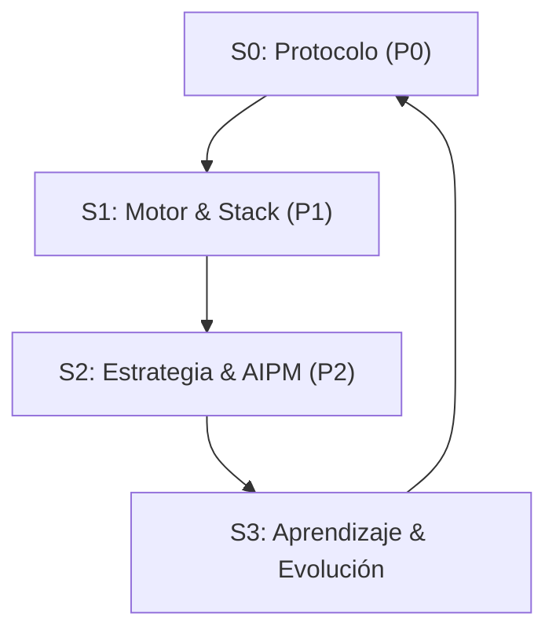

# Filosofía de Trabajo: La Tríada AI-Prime 🔱

Este directorio contiene la inteligencia operativa de **PersonalOS**, consolidada en **3 Pilares Cognitivos** para maximizar la eficiencia y precisión del asistente.

## 🏛️ Estructura de Poder

1.  **[🔘 Pilar 0: Protocolo](02_Pilar_Base.mdc):** ADN operativo, estándares de idioma (Español) y bucle de evolución de reglas.
2.  **[🛠️ Pilar 1: Motor](03_Pilar_Motor.mdc):** Ingeniería profunda, Armor Layer, Premium UI y organización de Skills.
3.  **[🧠 Pilar 2: Estrategia](04_Pilar_Estrategia.mdc):** Gestión de tareas, contexto atómico y observabilidad AIPM (2026 Grade).

## 📋 Índice de Reglas (25 archivos)

| #   | Regla                              | Propósito                                   |
| --- | ---------------------------------- | ------------------------------------------- |
| 01  | `01_Context_Protocol.mdc`          | Protocolo de contexto obligatorio (Génesis) |
| 02  | `02_Pilar_Base.mdc`                | Pilares fundamentales del sistema           |
| 03  | `03_Pilar_Motor.mdc`               | Motor y stack técnico                       |
| 04  | `04_Pilar_Estrategia.mdc`          | Estrategia y AIPM                           |
| 05  | `05_ritual-integrity.mdc`          | Integridad de ritus                         |
| 06  | `06_Claude_Integration.mdc`        | Integración Claude                          |
| 07  | `07_Skill_Fusion.mdc`              | Fusión de skills                            |
| 08  | `08_Observability.mdc`             | Observabilidad                              |
| 09  | `09_Elite_Reporting.mdc`           | Reporting de élite                          |
| 10  | `10_Context_Management.mdc`        | Gestión de contexto                         |
| 11  | `11_Workflow_Standards.mdc`        | Estándares de workflow                      |
| 12  | `12_Nexus-Routing.mdc`             | Enrutamiento Nexus                          |
| 13  | `13_Testing_Resource_Management.mdc` | Testing y recursos                          |
| 14  | `14_Invoice_Intelligence.mdc`      | Inteligencia de facturas                    |
| 15  | `15_Backlog_Processing.mdc`        | Procesamiento de backlog                    |
| 16  | `16_Brainstorming.mdc`             | Brainstorming                               |
| 17  | `17_Genesis.mdc`                   | Protocolo de inicio de sesión               |
| 18  | `18_Morning_Standup.mdc`           | Standup matutino                            |
| 19  | `19_Planning.mdc`                  | Planificación                               |
| 20  | `20_Recap_Morning.mdc`             | Recap matutino                              |
| 21  | `21_Gentleman_Framework.mdc`       | Framework Gentleman                         |
| 35  | `35_Pencil_Design_Studio.mdc`      | Estudio de diseño Pencil                    |

## 🔄 El Bucle de Oro (The Golden Loop)

El sistema opera bajo un flujo circular que asegura que cada acción sea estratégica:

- **ADN (Pilar 0)**: Define el Protocolo.
- **Músculo (Pilar 1)**: Ejecuta con el Motor.
- **Cerebro (Pilar 2)**: Orquesta la Estrategia.

---

_ "El código es temporal, los Pilares son eternos." _
