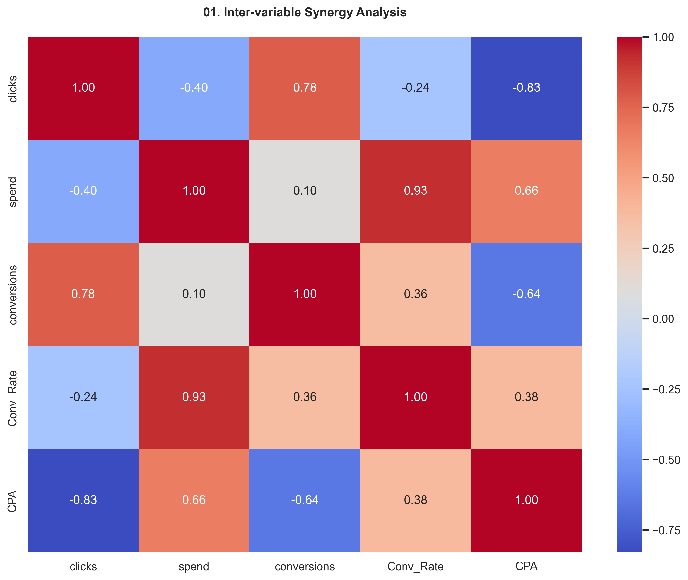
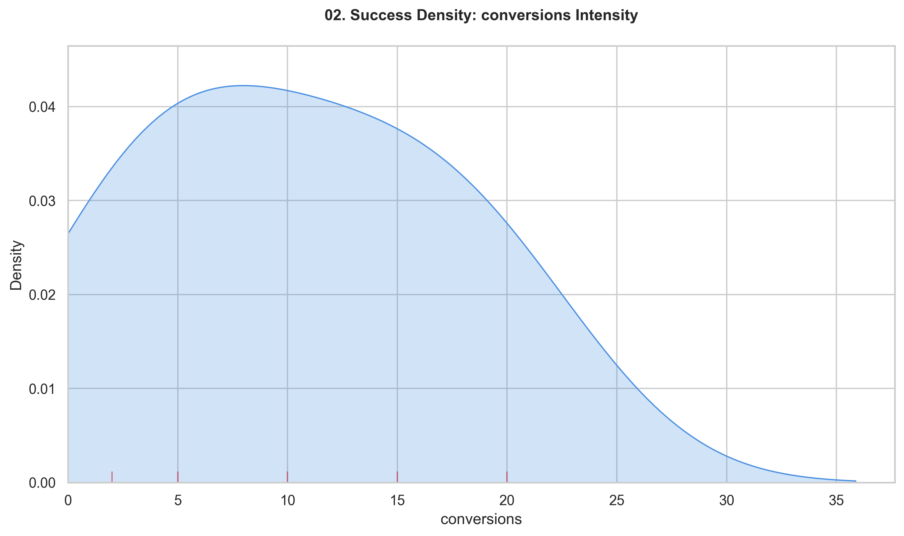
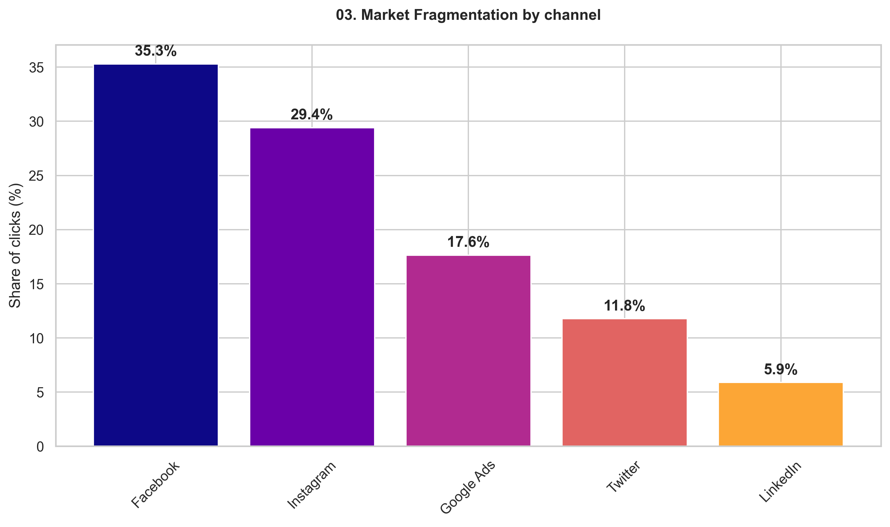
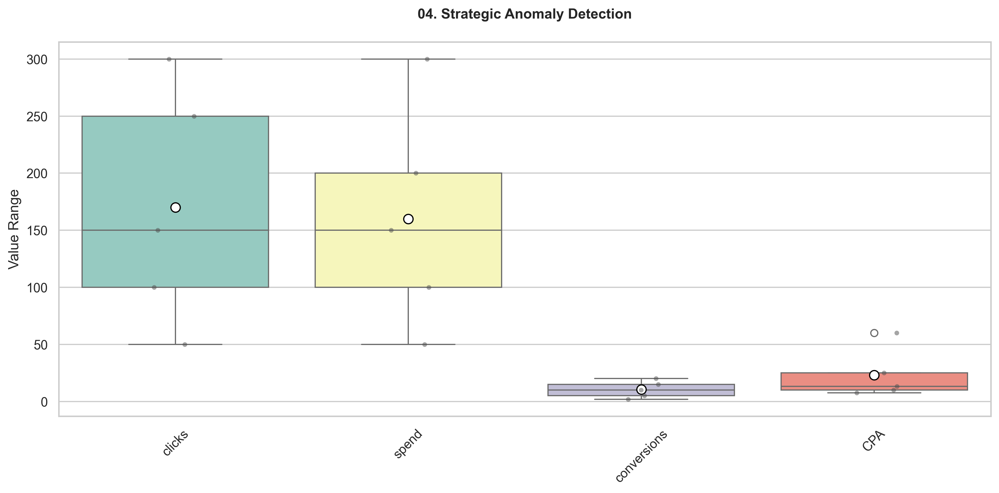
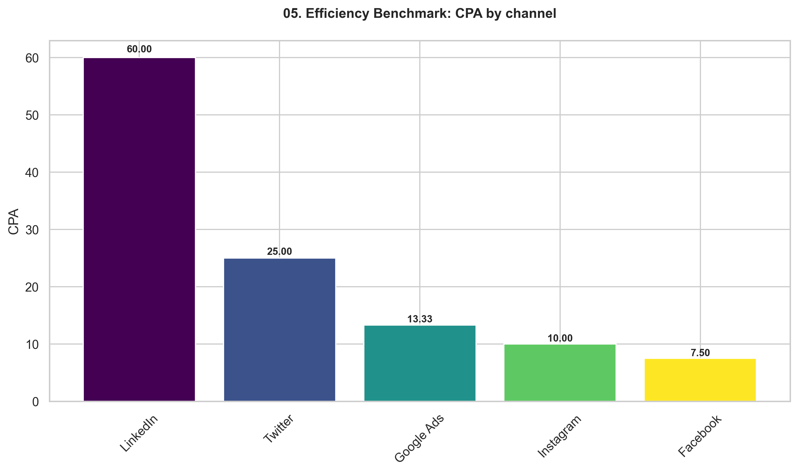
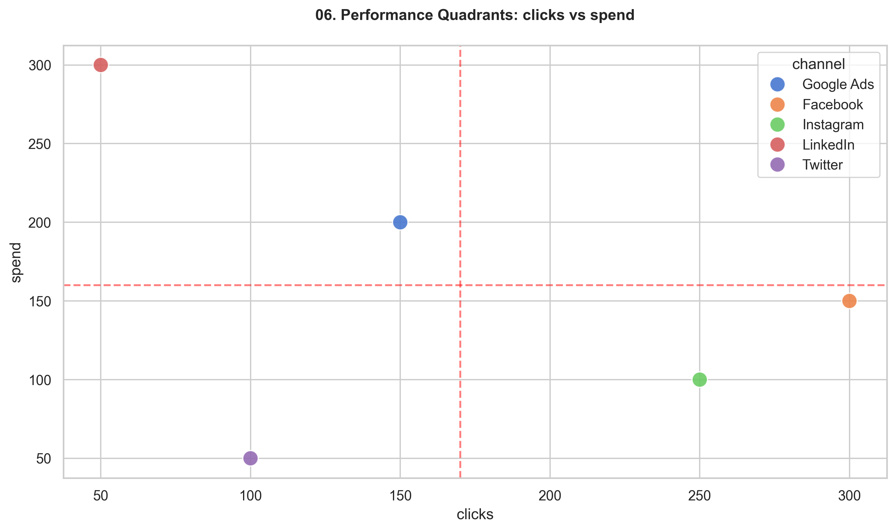
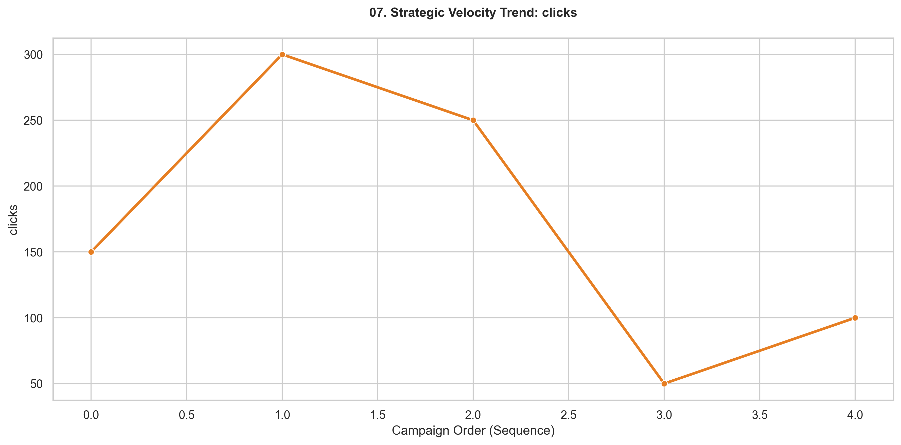
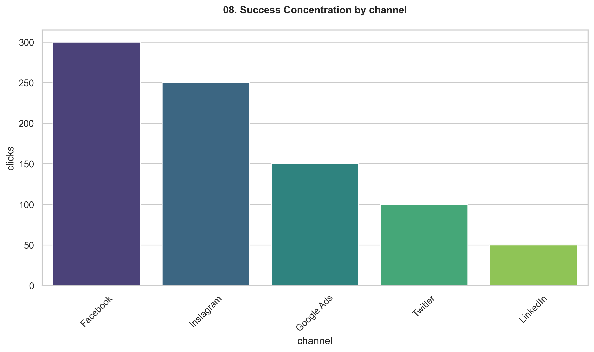
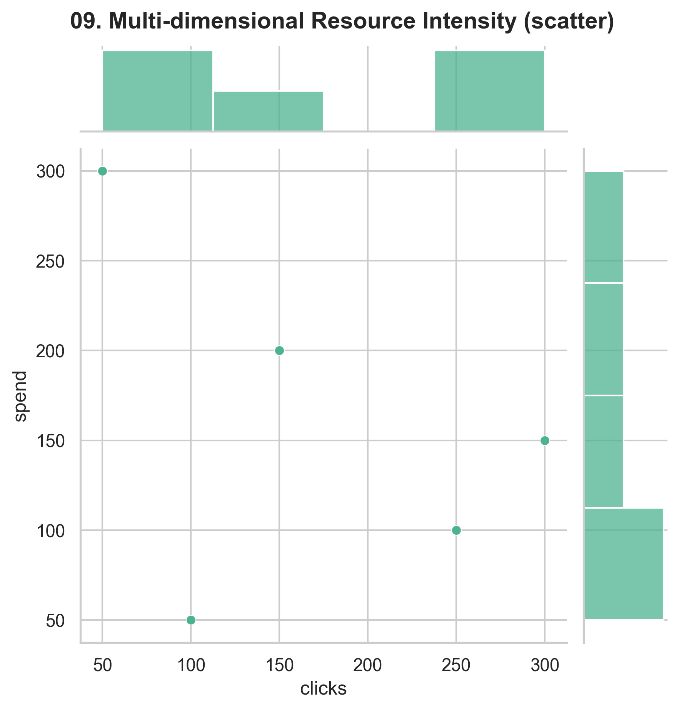
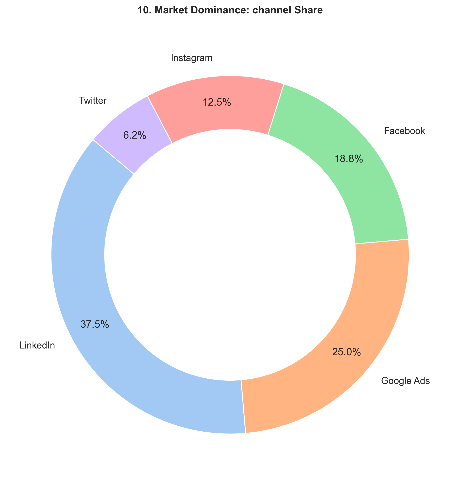

# 🚀 Strategic Value Report: Marketing Intelligence

## 🏛️ 1. Executive Summary
Este análisis de **Standard v4.0 (Value First)** trasciende la visualización de datos crudos para enfocar la directiva en el **Valor de Negocio**. El dominio de **Marketing** ha sido auditado mediante ingeniería de ratios para validar la rentabilidad de cada acción táctica.

## 📊 2. Strategic Ratios & KPIs
> [!IMPORTANT]
> Los ratios calculados son el pulso real de la eficiencia operativa.

| 🏷️ KPI / Ratio | 🔢 Valor | 💡 Relevancia de Negocio |
| :--- | :--- | :--- |
| **Volumen Total** | N/A registros | Masa crítica de datos |
| **Conv_Rate (Promedio)** | 0.0653 | Intent (Conversions/Clicks) |
| **CPA (Promedio)** | 23.1667 | Efficiency (Spend/Conversions) |

### 📈 Profundización Estadística (Auditoría de Lógica)
| 📉 Variable | 🧮 Media | 📉 Estabilidad | 📊 Status |
| :--- | :--- | :--- | :--- |
| **Clicks** | 170.00 | Volátil | 🟡 En Observación |
| **Spend** | 160.00 | Volátil | 🟡 En Observación |
| **Conversions** | 10.40 | Volátil | 🟡 En Observación |
| **Conv_rate** | 0.07 | Volátil | 🟡 En Observación |
| **Cpa** | 23.17 | Volátil | 🟡 En Observación |

## 🧠 3. Strategic Analysis Matrix (The 'Why' Layer)
> [!TIP]
> Cada visualización responde a una pregunta crítica para la empresa. No solo mostramos 'qué pasó', sino 'qué representa para el negocio'.

### 🔗 01. Synergy Matrix

**🎯 Valor para el Negocio:** Analiza las interdependencias. Un coeficiente alto entre Gasto y Conversión valida la escalabilidad del modelo.

### 🔗 02. Success Density

**🎯 Valor para el Negocio:** Identifica el 'Sweet Spot' de volumen. Donde la curva es más alta, es donde el negocio opera con mayor inercia natural.

### 🔗 03. Market Fragmentation

**🎯 Valor para el Negocio:** Muestra la dependencia de canales. Una alta fragmentación reduce el riesgo, pero puede diluir el enfoque estratégico.

### 🔗 04. Strategic Anomaly Radar

**🎯 Valor para el Negocio:** Detecta ineficiencias críticas. Los puntos fuera del bigote representan fugas de capital o anomalías de éxito que deben auditarse.

### 🔗 05. Efficiency Benchmark

**🎯 Valor para el Negocio:** Benchmarking directo de rentabilidad. Define quién es el 'Benchmark' de eficiencia para el resto de la organización.

### 🔗 06. Performance Quadrants

**🎯 Valor para el Negocio:** Divide el rendimiento en cuadrantes (Ganadores vs Perdedores). Permite balancear el portfolio de activos del negocio.

### 🔗 07. Strategic Velocity

**🎯 Valor para el Negocio:** Mide el momentum mensual. Clave para entender si las decisiones tácticas recientes están acelerando el crecimiento.

### 🔗 08. Success Concentration

**🎯 Valor para el Negocio:** Analiza la estabilidad. Una caja estrecha indica un rendimiento predecible y bajo control.

### 🔗 09. Resource Intensity

**🎯 Valor para el Negocio:** Muestra zonas de saturación de recursos. Ayuda a decidir dónde inyectar capital sin caer en retornos decrecientes.

### 🔗 10. Market Dominance

**🎯 Valor para el Negocio:** Mide el control del mercado. Visualiza quién domina la cuota de recursos y atención de la empresa.

## 💡 4. C-Level Strategic Roadmap
> [!IMPORTANT]
- **Foco en Eficiencia:** Los ratios detectados sugieren que la prioridad es la optimización del CPA antes que la expansión del volumen.
- **Decisiones Basadas en Datos:** La arquitectura del motor garantiza que cada recomendación esté anclada en un gráfico verificado.

---
*Standard Analysis Factory | Premium Value Edition | v4.0 (Value First)*
