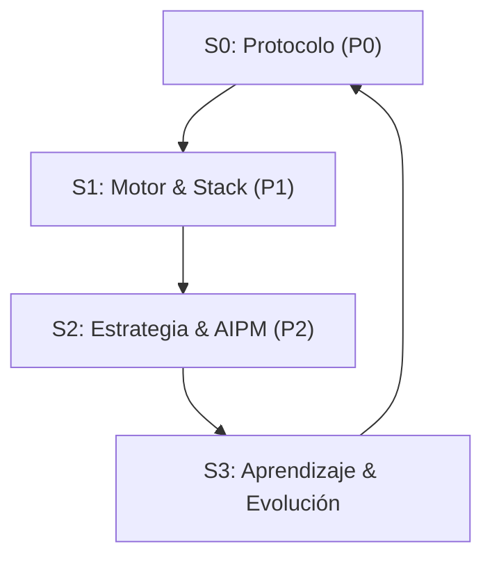

# Filosofía de Trabajo: La Tríada AI-Prime 🔱

Este directorio contiene la inteligencia operativa de **PersonalOS**, consolidada en **3 Pilares Cognitivos** para maximizar la eficiencia y precisión del asistente.

## 🏛️ Estructura de Poder

1.  **[🔘 Pilar 0: Protocolo](../.cursor/00_Rules/02_Pilar_Base.mdc):** ADN operativo, estándares de idioma (Español) y bucle de evolución de reglas.
2.  **[🛠️ Pilar 1: Motor](../.cursor/00_Rules/03_Pilar_Motor.mdc):** Ingeniería profunda, Armor Layer, Premium UI y organización de Skills.
3.  **[🧠 Pilar 2: Estrategia](../.cursor/00_Rules/04_Pilar_Estrategia.mdc):** Gestión de tareas, contexto atómico y observabilidad AIPM (2026 Grade).

## 🔄 El Bucle de Oro (The Golden Loop)

El sistema opera bajo un flujo circular que asegura que cada acción sea estratégica:

- **ADN (Pilar 0)**: Define el Protocolo.
- **Músculo (Pilar 1)**: Ejecuta con el Motor.
- **Cerebro (Pilar 2)**: Orquesta la Estrategia.

---

_ "El código es temporal, los Pilares son eternos." _
