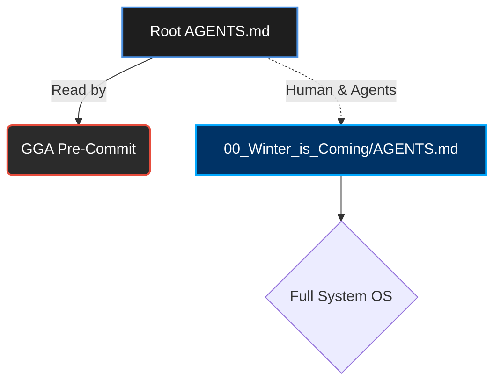

# 🛡️ Guardian Angel Entrypoint (GGA)

> [!CAUTION]
> **SYSTEM REDIRECT:** The main agent rules and OS capabilities are located in the [Matrix Core (Winter is Coming)](file:///c:/Users/sebas/Downloads/01%20Revisar/09%20Versiones/00%20Respaldo%20PC%20Sebas/01%20Github/personal-os/Think_Different/00_Winter_is_Coming/AGENTS.md). 
> This file exists in the root **exclusively** as a configuration loader for the **GGA (Guardian Angel) Pre-Commit Hook**.

---

## 🧭 Flow & Architecture

---

## ⚡ Code Review Rules (For GGA)

> [!IMPORTANT]
> The following rules must be enforced by Guardian Angel on every commit constraint check.

### TypeScript / JavaScript
- ✅ **Use `const` or `let`**.
- ❌ **NEVER use `var`**.
- ✅ **Prefer `interfaces` over `types`** for object structures.
- ❌ **No `any` types allowed** under any circumstances (Strict typing).

### React / Frontend
- ✅ **Use Functional Components** exclusively.
- ✅ **Prefer Named Exports** over default exports to ensure predictable refactoring and IntelliSense.

---
*Generated by Think Different PersonalOS v6.1 | Pure Green State*
